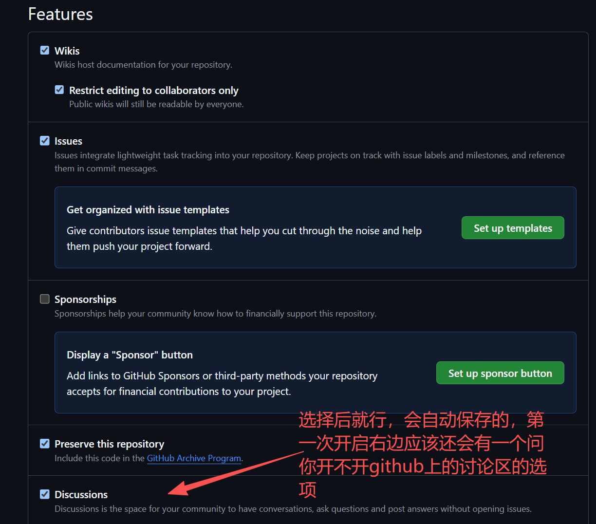
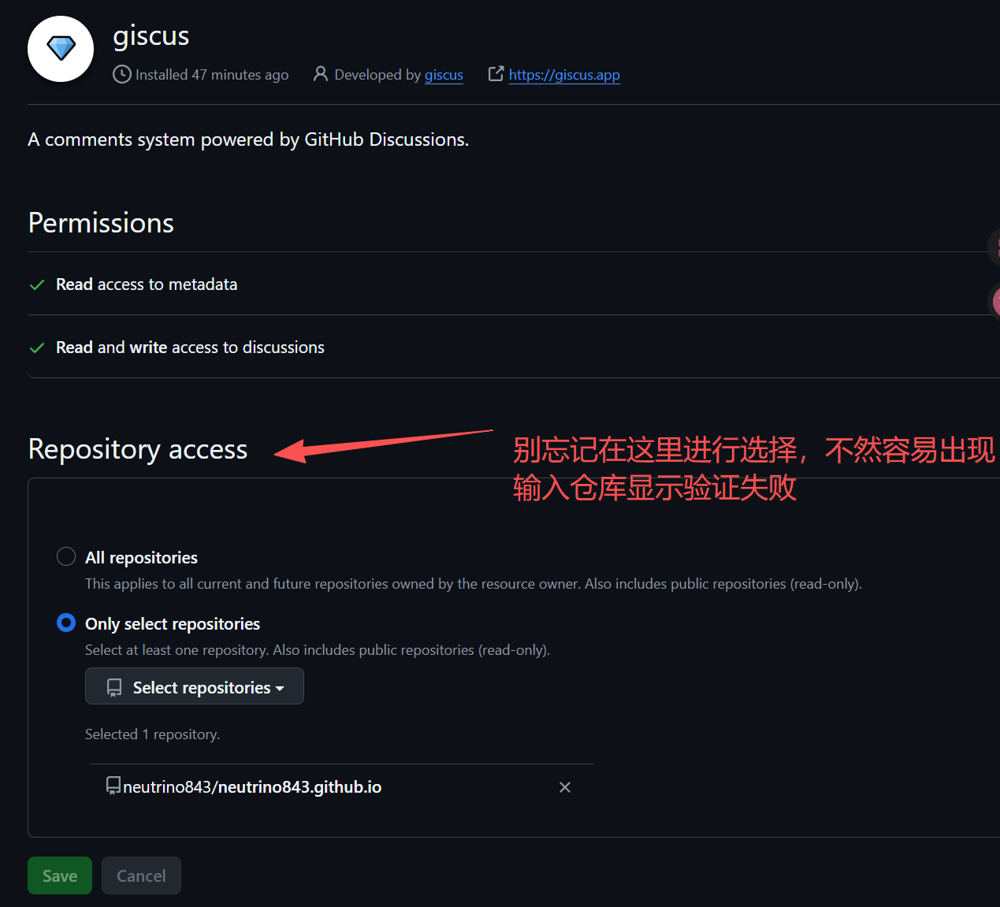
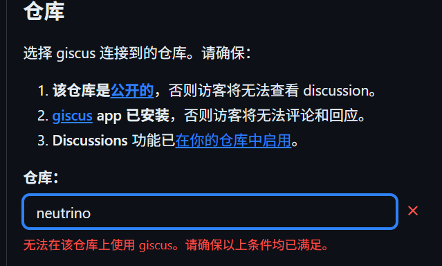

## 前言

之前博客没有评论区，看其他大佬的博客都有评论区，就想自己也配置一个，最开始想到是利用ai帮忙写一个评论区，后面发现工作量有点大调试太麻烦了，于是就一直搁置了，然后后面搜索相关的内容的时候看到了 Giscus 这个项目，发现很适合hugo 这个stack主题进行一个评论区的搭建，一句话概括就是：**用 GitHub Discussions 当数据库的评论区**。

而且上手很简单，加上不需要额外买服务器，不需要管数据库，访客用 GitHub 账号就能登录评论，所有数据都存在你自己仓库的 Discussions 里，完全可控。对咱们这种博客托管在 GitHub Pages 的开发者来说，简直就是天选方案。

这篇文章会从零开始，完整记录我配置的全过程，包括中间踩的坑，希望能帮你少走点弯路。
---

## 前置准备

在动手改代码之前，先把这几件事搞定：

### 1. 一个 GitHub 仓库

这个不需要多说，如果你是像我一样使用hugo+stack主题，利用github pages托管博客的话。那么你的 Hugo 博客源码肯定已经在 GitHub 上了。我的是 `neutrino843/neutrino843.github.io`，后面配置的时候会用到。

### 2. 开启 GitHub Discussions

这是最简单的一步，一定要去确认一下仓库的 Discussions 功能是否开启了。

首先去你仓库的 Settings 页面（https://github.com/你的用户名/仓库名/settings），往下翻到 **Features** 区域：
**勾选 Discussions**

搞定之后，你仓库顶部的标签栏会多出一个 **Discussions** 的 Tab，说明成功了。
### 3. 安装 Giscus GitHub App

打开 https://github.com/apps/giscus，点击 **Install**，选择你的仓库，授权。这一步是为了让访客能用 GitHub 账号登录发表评论。

### 4. 打开 Giscus 官网生成配置

访问 https://giscus.app，你会看到一个配置页面，按顺序填：

| 字段 | 填写内容 |
|------|----------|
| **Language** | 选 **简体中文** |
| **Repository** | 输入 `你的用户名/仓库名`，比如 我的就是
`https://github.com/neutrino843/neutrino843.github.io` |

填完仓库名之后，Giscus 会自动验证。如果 Discussions 没开启，它会提示你"该仓库尚未启用 Discussions"——那你就回到第 2 步去勾上，然后刷新页面。
> (这里有一个注意点，要记得满足上述的三个要求，先确认自己的仓库是否是公开的，然后是否安装了giscus app，如果没有的话点击网页上的链接然后安装，接着


一定要确认这一步是否选择了，不然容易出现错误，如下：


最后确认是否开启了 Discussions 功能。)

验证通过后，继续往下看：

| 字段 | 填写内容 |
|------|----------|
| **Discussion（分类）** | 选 **General** |
| **Mapping** | 选 **Discussion title contains page pathname** |
| **Theme** | 看你喜好，我选的 **Preferred color scheme** |

> 这里有个坑：因为我是参考ai给出的指导，他当时说是Discussion，我找半天没找到Discussion，当时在这愣了半天，以为是页面没加载出来……后面发现就是选中文显示的Discussion  QAQ

选完 Discussion 之后，页面的“启用giscus”这个标签下面，会自动生成一段 `<script>` 代码，大概长这样：

```html
<script src="https://giscus.app/client.js"
        data-repo="neutrino/neutrino"
        data-repo-id="[在此输入仓库 ID]"
        data-category="[在此输入分类名]"
        data-category-id="[在此输入分类 ID]"
        data-mapping="pathname"
        data-strict="0"
        data-reactions-enabled="1"
        data-emit-metadata="0"
        data-input-position="bottom"
        data-theme="preferred_color_scheme"
        data-lang="zh-CN"
        crossorigin="anonymous"
        async>
</script>
```

把这段代码里的 `data-repo-id` 和 `data-category-id` 记下来，后面要用，如果没有的话检查一下是不是前面哪一步漏了。**这两个值每个仓库都不一样**。

---

## Hugo Stack 主题配置

好消息是：Hugo Stack 主题**原生就支持 Giscus**，不需要自己写模板代码，只需要改配置文件就行。所以只需要在配置文件里改一下，就可以使用 Giscus 评论系统。
> **注意**：Stack 主题默认是 Disqus Disqus 评论系统，所以要切换到 Giscus，需要在配置文件里修改一下。

### 修改站点配置文件

找到 `config/_default/params.toml`（如果你用的是 YAML 格式，就是 `params.yaml`），把评论系统从 Disqus 切到 Giscus。

原来应该是这样的：

```toml
[comments]
    enabled  = true
    provider = "disqus"
```

改成：

```toml
[comments]
    enabled  = true
    provider = "giscus"

    [comments.giscus]
        repo             = "neutrino843/neutrino843.github.io"
        repoID           = "R_kgDOSPdDpA"
        category         = "General"
        categoryID       = "DIC_kwDOSPdDpM4C-zBr"
        mapping          = "pathname"
        lightTheme       = "light"
        darkTheme        = "dark_dimmed"
        reactionsEnabled = 1
        emitMetadata     = 0
        inputPosition    = "top"
        lang             = "zh-CN"
        strict           = 0
        loading          = "lazy"
```

逐个说一下这些参数是干嘛的：

| 参数 | 说明 |
|------|------|
| `repo` | 你的仓库名，格式 `用户名/仓库名` |
| `repoID` | 仓库的 GitHub Node ID，从 giscus.app 生成的代码里抄 |
| `category` | Discussions 分类名，这里用的 `General` |
| `categoryID` | 分类的 Node ID，也从 giscus.app 抄 |
| `mapping` | 文章和 Discussion 的关联方式，`pathname` 表示按 URL 路径匹配 |
| `lightTheme` / `darkTheme` | 浅色/深色主题，Stack 会自动根据当前配色切换 |
| `lang` | Giscus 界面语言，`zh-CN` 就是简体中文 |
| `inputPosition` | 评论输入框位置，`top` 在顶部，`bottom` 在底部 |

> **注意**：`repoID` 和 `categoryID` 是 GitHub 内部的 Node ID，一串类似 `R_kgXXXXX` 和 `DIC_kgXXXXX` 的编码，**不要随便编一个填进去**，一定要从 giscus.app 生成的代码里拿。

### 模板文件需要改吗？

不需要。Stack 主题已经内置了评论区加载逻辑，路径在 `layouts/_partials/comments/include.html`，它会根据 `provider` 的值自动加载对应的 `comments/provider/giscus.html` 模板。

不过如果你想确认一下，可以看看主题里有没有这个文件：

```
themes/hugo-theme-stack/layouts/_partials/comments/provider/giscus.html
```

如果存在，那说明主题支持，你就不用管了。

### 单个文章关闭评论

如果你不想让某篇文章显示评论区，在文章 Front Matter 里加一行就行：

```yaml
---
title: "某篇文章"
comments: false
---
```

这样那篇文章底部就不会加载评论框了。

---

## 验证和调试

### 本地构建测试

在终端执行：

```bash
hugo server
```

打开一篇博客文章，拉到最底部，你应该能看到 Giscus 的评论框：

- 未登录状态会显示 **"Sign in with GitHub"** 按钮
- 点击后会跳转到 GitHub 授权页面
- 授权完成后回到文章页面，就可以发表评论了

### 常见问题排查

#### Q：评论区完全不显示

检查这几个地方：

1. **`enabled = true` 有没有写对？** 别把 `true` 写成 `false`
2. **`provider = "giscus"` 有没有拼错？** 注意拼写，不是 `giscuss`
3. **`repoID` 和 `categoryID` 是否为空？** 如果没填或者填错了，Giscus 不会加载
4. **页面 Console 报错？** 按 F12 打开开发者工具，看 Console 有没有红字报错

#### Q：评论区显示但无法登录

检查 GitHub App 有没有安装。打开 https://github.com/settings/installations 看看 giscus app 是否已授权给你的仓库。

#### Q：样式对不上 / 评论区太丑

Giscus 会根据 `lightTheme` 和 `darkTheme` 自动切换样式。Stack 主题内置了明暗切换监听，能自动同步。你可以在 `params.toml` 里换其他主题试试：

```toml
lightTheme = "light"          # 浅色
darkTheme  = "dark_dimmed"    # 深色
```

Giscus 支持的主题名称可以翻它的文档：https://github.com/giscus/giscus/blob/main/ADVANCED-USAGE.md

#### Q：Disqus 的历史评论怎么办？

如果你之前用 Disqus，迁移后旧的评论就看不到了。Giscus 和 Disqus 的数据不互通。

一个折中方案：**把 Disqus 的评论导出成静态文件**，手动贴在每篇文章底部。Disqus 后台有导出功能，只是操作起来有点麻烦，适合评论不多的情况。

---

## 最后

整体来说，配置 Giscus 不算复杂，核心就是三步：

1. 在仓库设置里开启 Discussions
2. 去 https://giscus.app 生成配置代码，拿到 `repoID` 和 `categoryID`
3. 在 Hugo 的 `params.toml` 里填好配置

如果顺畅的话，整个过程前后花不了十分钟，效果却提升不少——没有广告、加载飞快、数据完全归自己管。如果你也在用 Hugo Stack 主题，非常推荐使用喵。

有啥配置过程中遇到的问题，欢迎在评论区留言（没错就是底下这个评论区），一起交流。
希望这篇文章能给你提供一点点帮助，关注猫猫谢谢喵。
